# Game Engagement Analysis Project

## Overview

This project explores user engagement, retention, and growth for a mobile game using advanced data analysis techniques. The goal is to identify bottlenecks, opportunities, and actionable strategies to enhance performance and ensure sustainable growth.

---

## App Overview

**These screenshots provide context for user interactions and illustrate the journey from app discovery to engagement.**

---

### Impressions

**This image shows the total number of users who saw the app.**

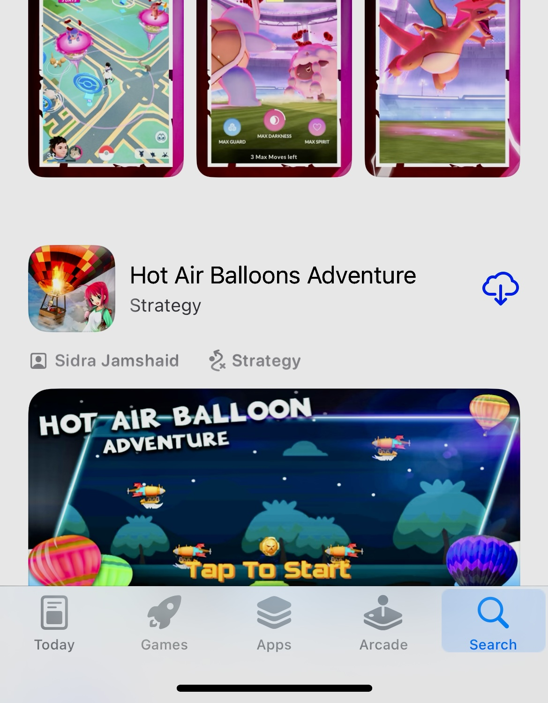

---

### Page Views

**This image highlights users who clicked through to view the app page.**

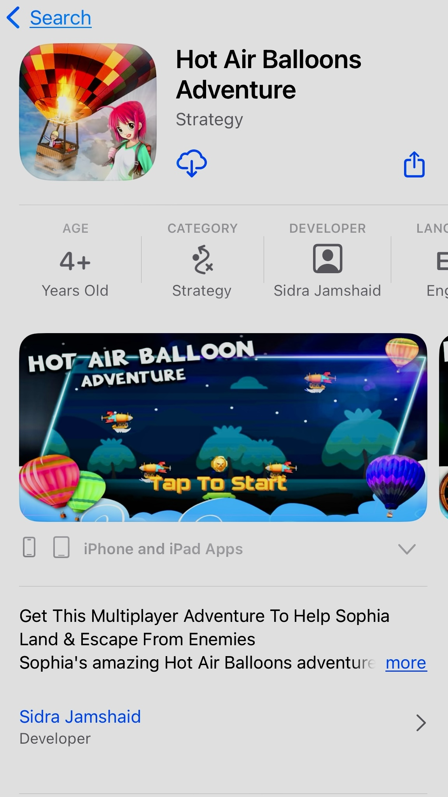

---

### Downloading Game

**This image demonstrates the process of users downloading the game.**

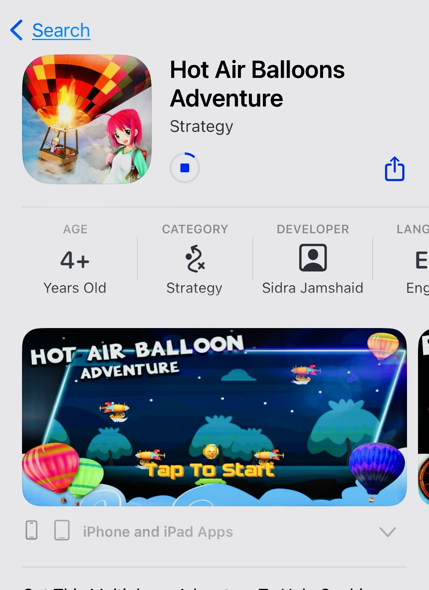

---

### Installing Game

**This image showcases users installing the game after downloading it.**

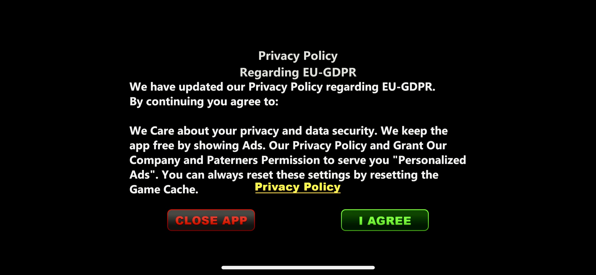

---

### Gameplay Highlights

**This image illustrates key gameplay moments, showing user engagement with the game.**

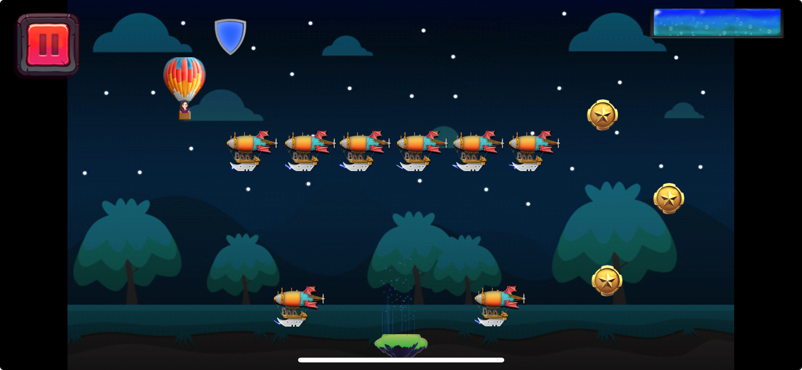

---

## Problem Statement

Mobile games often face challenges in retaining users, optimizing growth, and ensuring performance stability. This analysis aims to:

- Identify bottlenecks in the user funnel.
- Understand regional and iOS version-specific performance.
- Provide actionable recommendations for sustained growth and user retention.

---

## Business Impact

This project provides insights that can help:

- **Increase Revenue**: By improving funnel conversions and retention rates.
- **Optimize Marketing**: By identifying high-performing regions and user segments.
- **Enhance User Experience**: By addressing app crashes and improving engagement.

---

## Phases of the Project

### **Phase 1: Funnel Analysis**

**Goal**: Understand the conversion funnel from impressions to installations.

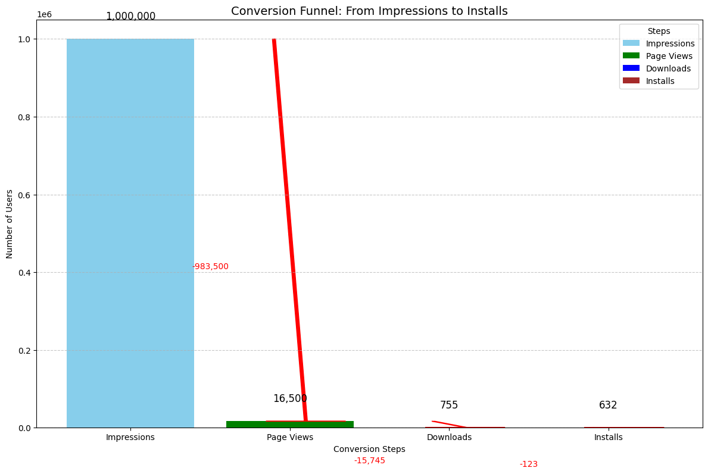

- **98% Drop-off**: Most users drop off between impressions and installs.
- **Retention Strength**: High retention rates among users who install the app.

**Takeaway**:

- Simplify onboarding and improve app store visuals to reduce drop-offs.

---

### **Phase 2: Regional Performance**

**Goal**: Identify regional strengths and opportunities.

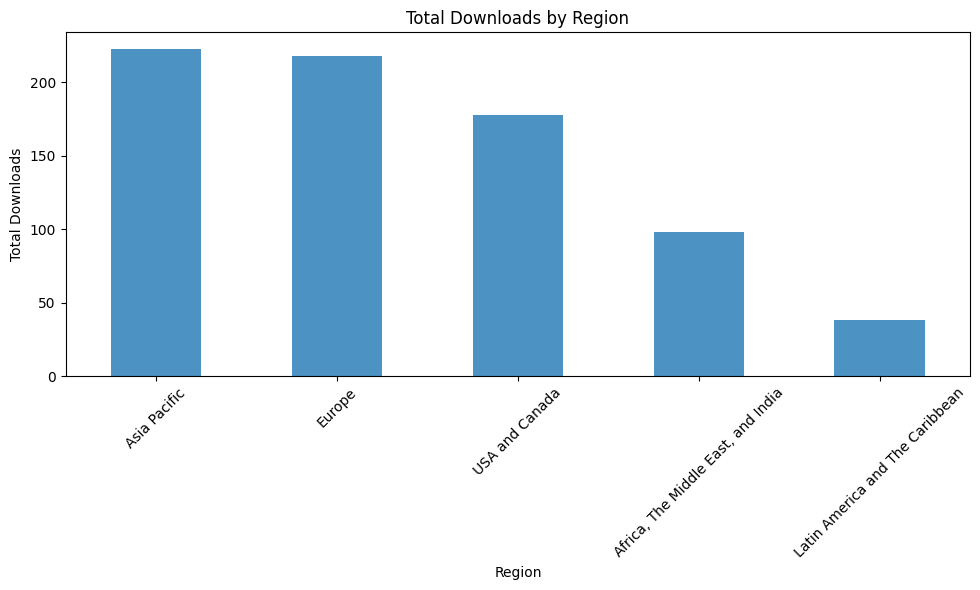

- **Top Regions**: Asia Pacific and Europe dominate downloads.
- **Opportunities**: Africa, the Middle East, and Latin America need targeted campaigns.

**Takeaway**:

- Localize marketing efforts for underperforming regions.

---

### **Phase 3: Retention and Churn Analysis**

**Goal**: Analyze retention trends and identify churn factors.

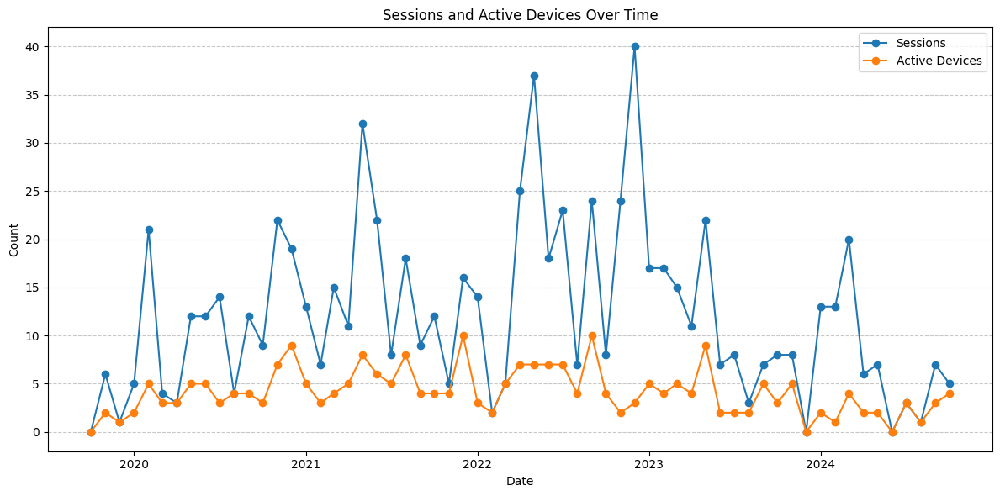

- **Retention Improvements**: Retention days increased from **30 in 2020** to **45 in 2023**.
- **Declining Churn**: Deletion rates dropped from **18% in 2020** to **10% in 2023**.

**Takeaway**:

- Introduce loyalty programs to retain users and reduce churn further.

---

### **Phase 4: iOS Version Performance**

**Goal**: Analyze downloads and crash rates by iOS version.

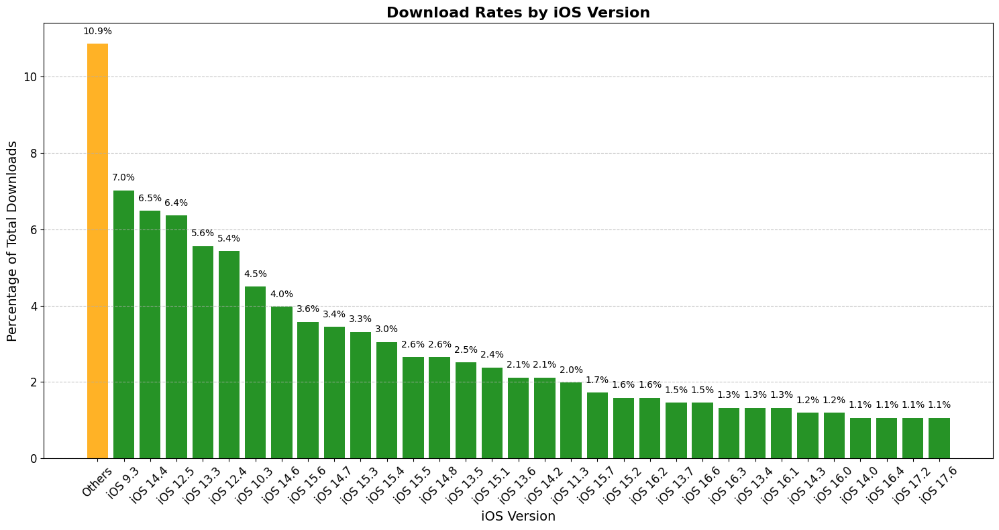

- **Key Versions**: A few iOS versions dominate downloads, while others contribute minimally (<1%).
- **Crash Rate**: Low overall crash rate (~3.25%), but specific iOS versions need debugging.

**Takeaway**:

- Prioritize debugging for high-crash versions to improve user satisfaction.

---

### **Phase 5: Engagement Analysis**

**Goal**: Examine session patterns and active device trends.

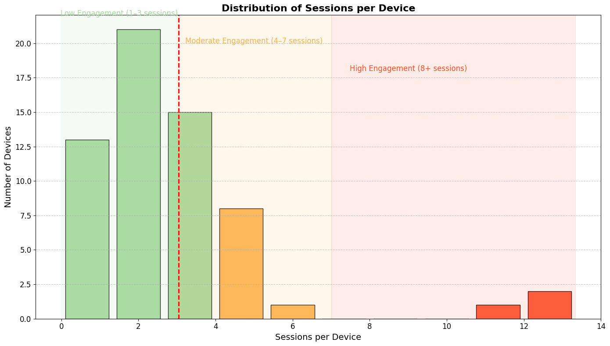

- **Engagement Peaks**: Align with updates or promotions.
- **Weekly Stability**: Weekly trends smooth out daily fluctuations.

**Takeaway**:

- Replicate strategies from high-engagement periods for sustained growth.

---

### **Phase 6: Crash and Deletion Trends**

**Goal**: Assess the relationship between crashes and deletions.

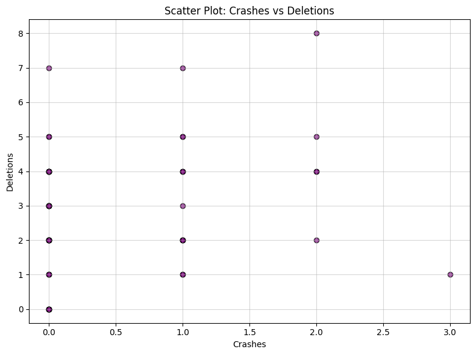

- **Moderate Correlation**: Crashes moderately influence deletions (~0.65 correlation).
- **Crash Rate Stability**: Crashes consistently account for ~3.25% of total events.

**Takeaway**:

- Focus on maintaining low crash rates to minimize deletions.

---

### **Phase 7: Forecasting Sessions and Impressions**

**Goal**: Predict future growth and plan resource allocation.

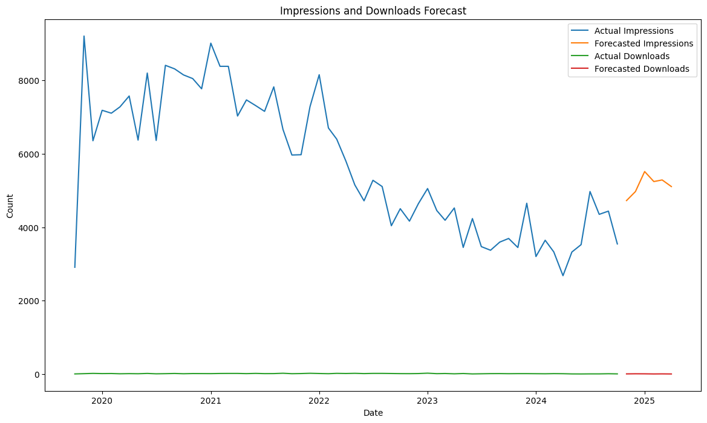

- **Projected Growth**: Sessions are forecasted to grow steadily over the next 6 months.
- **Fluctuating Downloads**: Requires consistent user acquisition strategies.

**Takeaway**:

- Use forecasts to plan campaigns and allocate resources effectively.

---

## Technical Skills Demonstrated

- **Data Cleaning & Transformation**: Pandas for merging, filtering, and cleaning datasets.
- **Visualization**: Matplotlib and Seaborn for compelling plots.
- **Retention Analysis**: Cohort heatmaps, churn metrics, and engagement trends.
- **Forecasting**: Time-series modeling with Exponential Smoothing.
- **Advanced Metrics**: Funnel analysis and correlation studies.

---

## Tools and Libraries Used

- **Python**: For data analysis and preprocessing.
- **Pandas**: Data cleaning, manipulation, and merging datasets.
- **Matplotlib and Seaborn**: Creating visualizations for insights.
- **Statsmodels**: Time-series forecasting and trend analysis.
- **Jupyter Notebooks**: Interactive data exploration and presentation.

---

## Repository Contents

- **`Hot air Baloon/`**: Cleaned datasets used in the analysis.
- **`main/`**: Jupyter Notebooks with detailed code and analysis.
- **`image/README/`**: Graphs and charts used in the report.
- **`Report/`**: PDF report summarizing all findings.
- **`README.md`**: This project overview.

---

## Recommendations

1. **Optimize Funnel Conversion**:

   - Simplify onboarding to reduce drop-offs.
   - Improve app store visuals and descriptions.
2. **Boost Retention**:

   - Implement loyalty programs for highly engaged users.
   - Use personalized campaigns for re-engagement.
3. **Expand Regional Campaigns**:

   - Localize marketing for underperforming regions (e.g., Africa, Latin America).
4. **Stabilize Performance**:

   - Debug high-crash iOS versions to improve user satisfaction.
   - Conduct automated testing for app stability.
5. **Leverage Forecasts**:

   - Plan resources and campaigns based on projected impressions and downloads.

---

## Future Work

1. Implement advanced machine learning models (e.g., ARIMA, LSTM) for more accurate forecasting.
2. Expand the analysis to include monetization metrics like in-app purchases and ad revenue.
3. Perform qualitative analysis by integrating user feedback to address specific pain points.

---

## Contact

Feel free to reach out for collaborations or inquiries:

- **Email**:    sidrajamshaid01@gmail.com
- **LinkedIn**: [Sidra Jamshaid](https://www.linkedin.com/in/sidrajamshaid/)
- **Game Link**: [Hot Air Balloons Adventure](https://apps.apple.com/dk/app/hot-air-balloons-adventure/id1449372577)
